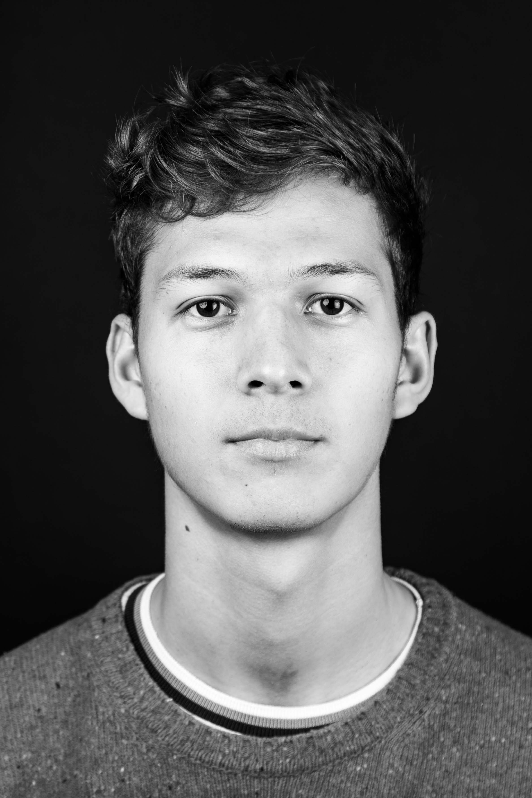

# Danish Kashaev  

I am currently a final year PhD student in the Networks and Optimization group at Centrum Wiskunde & Informatica, Amsterdam. Previously, I did a master's degree in mathematics at ETH Zurich and a bachelor's degree in mathematics at the University of Geneva. 

My main research interests are currently in combinatorial optimization, with some previous work done in approximation algorithms, online algorithms and algorithmic game theory.

# Publications

- ***Improved Online Load Balancing in the Two-Norm***  
  Sander Borst, Danish Kashaev  
  [ArXiv version](https://arxiv.org/abs/2511.03345)

- ***Selfish, Local and Online Scheduling via Vector Fitting***  
  Danish Kashaev  
  **SODA 2026**  
  [ArXiv version](https://arxiv.org/abs/2505.10082)  
  [Slides](slides_PoA.pdf)

- ***Online Matching on 3-Uniform Hypergraphs***  
  Sander Borst, Danish Kashaev, Zhuan Khye Koh  
  **IPCO 2025**  
  [ArXiv version](https://arxiv.org/abs/2402.13227)  
  [Conference version](https://link.springer.com/chapter/10.1007/978-3-031-93112-3_8)  
  [Slides](slides_online_matching.pdf)

- ***A Nearly Optimal Randomized Algorithm for Explorable Heap Selection***  
  Sander Borst, Daniel Dadush, Sophie Huiberts, Danish Kashaev  
  **IPCO 2023, Mathematical Programming 2024**  
  [ArXiv version](https://arxiv.org/abs/2210.05982)  
  [Journal version](https://link.springer.com/article/10.1007/s10107-024-02145-5)
  

- ***Round and Bipartize for Vertex Cover Approximation***  
  Danish Kashaev, Guido Schäfer  
  **APPROX 2023**  
  [ArXiv version](https://arxiv.org/abs/2211.01699)  
  [Conference version](https://drops.dagstuhl.de/entities/document/10.4230/LIPIcs.APPROX/RANDOM.2023.20)  
  [Slides](slides_vertex_cover.pdf)

- ***A Simple Optimal Contention Resolution Scheme for Uniform Matroids***  
  Danish Kashaev, Richard Santiago  
  **Theoretical Computer Science 2023**  
  [ArXiv version](https://arxiv.org/abs/2105.11992)  
  [Journal version](https://www.sciencedirect.com/science/article/pii/S0304397522006545?via%3Dihub)  
  [Slides](slides_CRS.pdf)
   
# Theses

- **Master's thesis:** _An Optimal Monotone Contention Resolution Scheme for Uniform and Partition Matroids_  
  Danish Kashaev  
  ETH Zurich, Institute for Operations Research  
  [Final version](master_thesis_final_v.pdf)
